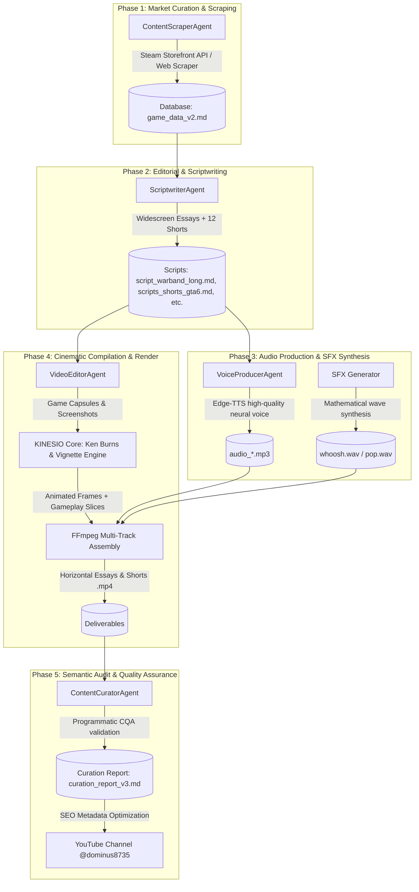

# KINESIO: Autonomous Video-Agent & Programmatic Editing Engine

KINESIO is a zero-bloat, high-performance autonomous ecosystem for programmatic multi-format video generation (YouTube Shorts, TikToks, and widescreen retrospectives) directly from game data, assets, and markdown scripts. 

Inspired by the **VideoAgent** architecture (HKUDS), KINESIO orchestrates specialized subagents to scrape Steam store assets, write high-hook narration scripts, synthesize neural voiceovers, apply dynamic cinematic editing effects (Ken Burns transitions, custom color grading, animated captions), and programmatically compile the final media using FFmpeg.

---

## 💡 Philosophy
No bloated heavy video editing frameworks (like Premiere, After Effects, or MoviePy wrappers). KINESIO relies on **raw Python (Pillow)** for high-speed frame manipulation in memory and **FFmpeg** for low-level multi-track audio-video multiplexing. Fast, reproducible, and 100% automated.

---

## 🏗️ System Architecture



---

## 🔥 Key Visual Features

*   **Cinematic Ken Burns Engine:** Programmatic zoom-in, zoom-out, and panning effects calculated dynamically frame-by-frame on blurred backgrounds using Pillow, avoiding FFmpeg's jittery zoompan filters.
*   **Dynamic Gameplay Slicing:** FFmpeg-based scale, crop, and pad parameters that dynamically pan and zoom gameplay clips based on the overlay duration, making clips feel alive and cinematic.
*   **Word-Count Audio-Video Alignment:** Analyzes narration scripts on the fly, counts words per chapter, and dynamically computes timestamps to slice and match gameplay scenes with voiceovers.
*   **Animated Impact Captions:** Renders rapid-fire, TikTok-style word subtitles in heavy impact font with outline strokes, alternating colors for visual retention.
*   **Mathematical SFX Synthesis:** Synthesizes high-fidelity WAV sound effects (e.g. whoosh, pop) using trigonometric equations directly on raw PCM byte streams.

---

## 📁 Repository Structure

| File / Folder | Role |
| :--- | :--- |
| `capsules/` | Steam store vertical capsule artwork (600x900) |
| `screenshots/` | High-resolution game captures for widescreen essays |
| `trailers/` | High-definition official game trailers and gameplay footage |
| `music/` | Local library of royalty-free background music categorized by mood |
| `kinesio_core.py` | Central rendering utility engine (caching, Ken Burns, vignettes, progress bars) |
| `compile_gta6_videos.py` | Compilation pipeline for the GTA VI vertical short series |
| `compile_warband_videos.py` | Compilation pipeline for Mount & Blade: Warband retrospective and shorts |
| `generate_audio_gta6.py` | Neural TTS voice generator for GTA VI scripts |
| `generate_audio_warband.py` | Neural TTS voice generator for Mount & Blade scripts |
| `video_manifest.md` | General catalog indexing all compiled videos, durations, and sizes |
| `gta6_campaign_seo.md` | High-hook organic titles (A/B options) and descriptions for GTA VI |
| `warband_campaign_seo.md` | SEO titles and tags metadata for the Mount & Blade campaign |

---

## 🚀 Getting Started

### Prerequisites
*   **Python 3.11+**
*   **FFmpeg** installed and configured in your system environment variables (with `libx264` and `aac` codecs).

### Installation
```bash
# Clone the repository
git clone https://github.com/DOMINUSBABEL/KINESIO.git
cd KINESIO

# Install dependencies
pip install Pillow edge-tts gTTS
```

### Quickstart / Running Campaigns

1.  **Generate voiceovers (TTS):**
    ```bash
    python generate_audio_gta6.py
    python generate_audio_warband.py
    ```
2.  **Download official assets & game storefront metadata:**
    ```bash
    python download_gta6_assets.py
    ```
3.  **Compile & render videos:**
    ```bash
    # Refactored pipelines utilizing the KINESIO Core engine
    python compile_gta6_videos.py
    python compile_warband_videos.py
    ```

---

## 🛠️ Programmatic SFX Synthesis Example

Sound effects are created purely using trigonometry. For example, here is the mathematically synthesized "Pop" effect for floating interactive badges:

```python
import math
import struct
import wave

def generate_pop(filename, duration=0.15, sample_rate=44100):
    obj = wave.open(filename, 'w')
    obj.setnchannels(1)
    obj.setsampwidth(2)
    obj.setframerate(sample_rate)
    
    num_samples = int(duration * sample_rate)
    for i in range(num_samples):
        t = i / sample_rate
        freq = 300 + 400 * (t / duration)  # Ascending pitch sweep
        # 10ms quick attack followed by exponential volume decay
        vol = t / 0.01 if t < 0.01 else math.exp(-30 * (t - 0.01))
        val = int(math.sin(2 * math.pi * freq * t) * vol * 22000)
        data = struct.pack('<h', val)
        obj.writeframesraw(data)
    obj.close()
```

---

## ✒️ Credits & License

*   **Project Director:** [Juan Esteban Gómez Bernal (DOMINUSBABEL)](https://github.com/DOMINUSBABEL)
*   **Development Agency:** [BABYLON.IA](https://babylonias.com)

KINESIO is a registered trademark of **BABYLON.IA** and is distributed under the MIT License.
