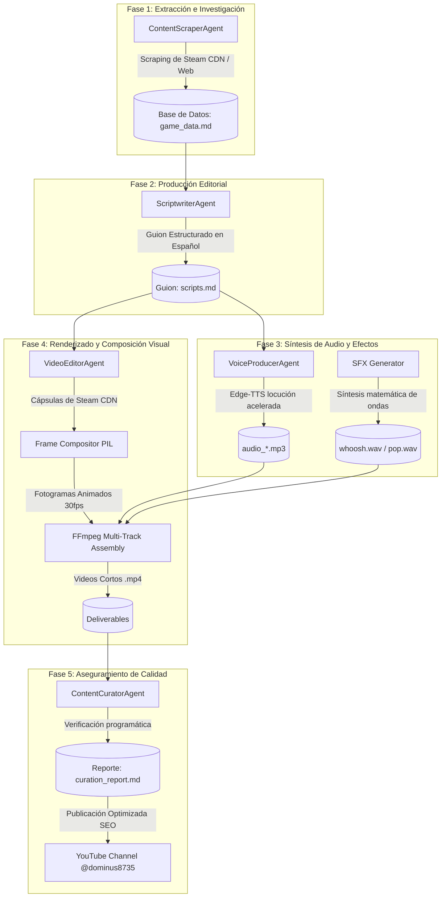

# KINESIO: Ecosistema Agéntico y Compositor Automático para Videos Cortos (YouTube Shorts)

KINESIO es un ecosistema agéntico para la creación y producción automatizada de videos en formato vertical (9:16, 1080x1920) optimizados para YouTube Shorts, TikTok e Instagram Reels. Diseñado bajo los patrones de arquitectura **VideoAgent** (HKUDS), KINESIO orquesta agentes especializados que investigan ofertas, redactan guiones persuasivos en español, sintetizan locuciones neuronales y ensamblan fotogramas animados y efectos de sonido (SFX) a nivel de microsegundos de forma 100% local, con consumo de API cero.

Este repositorio es una solución de nivel empresarial para creadores de contenido que buscan escalar su alcance y reactivar el crecimiento de sus canales mediante contenido altamente curado y estéticamente superior.

---

## 🏗️ Arquitectura de la Solución

El ecosistema opera mediante una arquitectura de pipeline desacoplada y secuencial, garantizando la resiliencia en cada fase del proceso:



---

## 🌟 Características Técnicas

*   **Alineación Temporal de Tomas (Shot Planning):** Cada video de 29 segundos está dividido matemáticamente en 7 tomas (Intro, 5 devisiones de videojuegos, Outro) sincronizadas a nivel de milisegundos con la pista de voz neural.
*   **Locución Neuronal Acelerada:** Utiliza `edge-tts` con la voz `es-MX-JorgeNeural` configurada con incrementos de velocidad dinámicos (`+28%` a `+38%`) para dotar a la voz en off de la energía y dinamismo propios de los formatos cortos de alto alcance.
*   **Composición Gráfica de Alta Fidelidad (PIL):** Renderizado fotograma a fotograma (30 fps) aplicando:
    *   **Filtros de Desenfoque:** Fondo dinámico aplicando filtros de desenfoque gaussiano de 25 píxeles y reducción de brillo por multiplicación alfa del 60%.
    *   **Máscaras de Transparencia:** Redimensionamiento y esquinas redondeadas de 20px en cápsulas de juegos oficiales usando máscaras de canal alfa.
    *   **Animación por Interpolación (Keyframing):** Transiciones de zoom elástico para portadas (0.8x a 1.0x) y efectos de rebote (overshoot) para insignias de descuento.
*   **Síntesis Programática de SFX:** Generación matemática de archivos WAV sin dependencias externas:
    *   *Whoosh (Transiciones):* Barrido de frecuencia sinusoidal de 150 Hz a 800 Hz modulado con ruido blanco y una curva de volumen de envolvente parabólica.
    *   *Pop (Aparición de Descuentos):* Onda senoidal con decaimiento exponencial rápido de volumen y barrido de pitch ascendente.
*   **Mezcla de Audio Multicanal (FFmpeg Complex Filter):** Pipeline de mezcla dinámico que retrasa (`adelay`) las pistas de efectos de sonido individuales según los puntos de cambio de toma del video y las mezcla (`amix`) en una única salida estereofónica junto a la voz principal y música de fondo (atenuada a `-22dB`).
*   **Curaduría y Aseguramiento de Calidad (CQA):** Agente de control de calidad programático que verifica la correlación semántica de imágenes, coherencia de precios frente a scripts y la integridad de metadatos del contenedor MP4.

---

## 📁 Estructura del Proyecto

```text
├── capsules/                  # Portadas de juegos oficiales (600x900) descargadas de Steam
├── generate_audio.py          # Agente VoiceProducer: Síntesis de voz con edge-tts
├── inspect_and_download.py    # Agente AssetsCollector: Descarga de portadas de Steam CDN
├── compile_shorts.py          # Agente VideoEditor: Renderizado de fotogramas y mezcla FFmpeg
├── verify_coherence.py        # Agente ContentCurator: Scripts de validación de calidad
├── game_data.md               # Datos consolidados de ofertas de Steam de verano 2026
├── scripts.md                 # Guiones y planificación temporal de tomas
├── curation_report.md         # Registro de auditorías de calidad de contenido
├── youtube_seo.md             # Títulos y descripciones optimizados para algoritmo de YouTube
├── README.md                  # Documentación técnica
└── .gitignore                 # Configuración de exclusiones Git
```

---

## 🚀 Instalación y Despliegue

### Prerrequisitos
1. **Python 3.11+**
2. **FFmpeg** configurado en las variables de entorno de tu sistema.

### Clonar e Instalar Dependencias
```bash
git clone https://github.com/DOMINUSBABEL/KINESIO.git
cd KINESIO
pip install Pillow edge-tts gTTS
```

### Ejecutar el Pipeline Completo
1. **Generar Locución:**
   ```bash
   python generate_audio.py
   ```
2. **Descargar Cápsulas Oficiales:**
   ```bash
   python inspect_and_download.py
   ```
3. **Renderizar y Compilar Videos MP4:**
   ```bash
   python compile_shorts.py
   ```
4. **Verificar Coherencia:**
   ```bash
   python verify_coherence.py
   ```

Los videos finales en formato vertical se exportarán en el directorio raíz como:
- `RTS_short.mp4`
- `City_short.mp4`
- `ARPG_short.mp4`

---

## 🛠️ Detalles del Motor de Efectos (SFX Generator)

Los efectos de sonido se generan dinámicamente mediante modulación matemática:

```python
# Muestra de generación de efecto "Pop" en verify_coherence.py
import math, struct, wave

def generate_pop(filename, duration=0.15, sample_rate=44100):
    samples = []
    num_samples = int(duration * sample_rate)
    for i in range(num_samples):
        t = i / sample_rate
        freq = 300 + 400 * (t / duration)  # Sweeping pitch up
        vol = t / 0.01 if t < 0.01 else math.exp(-30 * (t - 0.01)) # Fast attack, exp decay
        val = math.sin(2 * math.pi * freq * t) * vol * 0.7
        samples.append(val)
    # Escribir a WAV...
```

---

## ✒️ Créditos y Desarrollo

Este proyecto ha sido desarrollado bajo los estándares de ingeniería de software agéntica por:

*   **Creador y Director del Proyecto:** [Juan Esteban Gómez Bernal (DOMINUSBABEL)](https://github.com/DOMINUSBABEL)
*   **Empresa Desarrolladora:** [BABYLON.IA](https://babylonias.com)

KINESIO es una marca registrada de **BABYLON.IA** y su arquitectura agéntica de video se distribuye bajo la licencia MIT.
