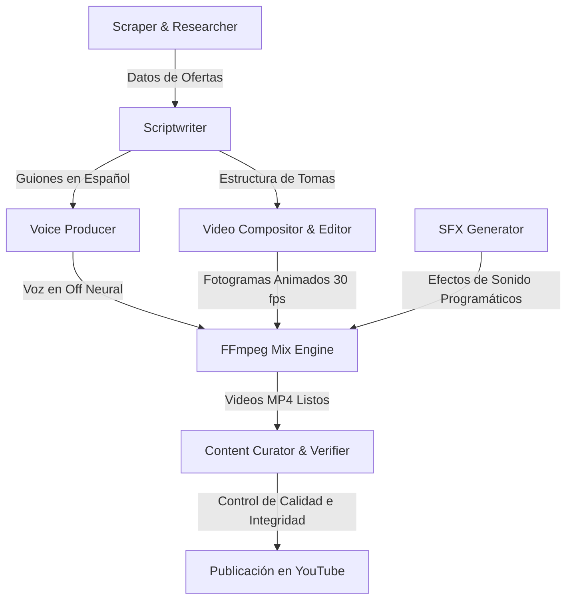

# KINESIO: Ecosistema Agéntico de Creación de Videos Cortos

KINESIO es un ecosistema de automatización y creación de videos cortos en formato vertical (YouTube Shorts, TikTok) inspirado en la arquitectura **VideoAgent** (HKUDS). El sistema organiza la creación de contenido mediante roles agénticos y renderizado programático local, permitiendo producir videos de alta fidelidad visual y sonora con un consumo nulo de cuotas de API de pago.

Este repositorio contiene las herramientas de orquestación, guionismo, síntesis de voz, generación de efectos de sonido (SFX) y ensamblaje final con FFmpeg.

---

## 🏗️ Arquitectura del Sistema (Flujo de Trabajo)

El ecosistema se subdivide en etapas modulares coordinadas por agentes especializados:



1. **Scraper & Researcher (Investigador):** Obtiene ofertas de videojuegos populares de la tienda de Steam de forma realista mediante consultas a servidores de distribución de contenido (CDN).
2. **Scriptwriter (Guionista):** Redacta guiones en español impecable, estructurados para videos de 25-30 segundos con ganchos (*hooks*) potentes en los primeros 3 segundos y llamados a la acción (CTA) de interacción al final.
3. **Voice Producer (Productor de Voz):** Genera locuciones fluidas y enérgicas en español utilizando modelos de síntesis de voz neural (`edge-tts`). Ajusta dinámicamente las tasas de velocidad de habla (`rate`) para garantizar que la locución quepa de forma precisa en el tiempo establecido.
4. **SFX Generator (Generador de Efectos):** Sintetiza de manera local y programática (con matemáticas básicas y la librería estándar de Python) archivos de audio de efectos especiales:
   - `whoosh.wav`: Para marcar las transiciones de tomas.
   - `pop.wav`: Para acentuar las apariciones y rebotes de los elementos visuales.
5. **Video Compositor & Editor (Compositor de Video):** Diseña y renderiza cada fotograma a 30 fotogramas por segundo utilizando `Pillow` (PIL) bajo una plantilla vertical premium de 1080x1920:
   - Fondo dinámico oscuro y difuminado (Ken Burns & Blur).
   - Cápsulas verticales oficiales con bordes de luz y esquinas redondeadas.
   - Animación de entrada por escala de zoom y rebote para insignias de descuento.
   - Barra de progreso de video y marca de agua del canal.
6. **FFmpeg Mix Engine (Ensamblaje):** Mezcla dinámicamente las pistas de voz en off, música de fondo de videojuegos, transiciones y efectos de sonido en posiciones de tiempo exactas usando filtros complejos de FFmpeg (`adelay`, `amix`).
7. **Content Curator & Verifier (Curador de Contenido):** Un agente supervisor ejecuta auditorías automatizadas para certificar que el texto en pantalla, la imagen y el juego nombrado en la locución estén 100% coordinados a nivel de microsegundos, previniendo cualquier anomalía visual.

---

## 🛠️ Requisitos e Instalación

Para ejecutar el ecosistema en tu máquina local, necesitarás disponer de:

1. **Python 3.11 o superior**
2. **FFmpeg** instalado y configurado en la variable de entorno global (PATH).

### Instalación de dependencias de Python:
```bash
pip install Pillow edge-tts gTTS
```

---

## 🚀 Instrucciones de Uso

Ejecuta el pipeline de creación de videos en el orden correspondiente:

1. **Generación de Voz en Off:**
   Genera las locuciones neuronales aceleradas a partir de los guiones creados:
   ```bash
   python generate_audio.py
   ```
2. **Descarga de Recursos Visuales:**
   Obtiene las portadas verticales oficiales (600x900) directamente desde Steam CDN:
   ```bash
   python inspect_and_download.py
   ```
3. **Compilación y Renderizado de Videos:**
   Crea y ensambla los videos con efectos de sonido, música de fondo, marcas de agua del canal y animaciones:
   ```bash
   python compile_shorts.py
   ```
4. **Verificación de Coherencia:**
   Ejecuta la prueba de coherencia y genera el reporte de control de calidad:
   ```bash
   python verify_coherence.py
   ```

Los videos resultantes se exportarán en formato vertical `.mp4` en el directorio raíz como:
- `RTS_short.mp4`
- `City_short.mp4`
- `ARPG_short.mp4`

---

## 🔒 Licencia
Este proyecto está desarrollado para el canal **DOMINUSBABEL** (`@dominus8735`) y se distribuye bajo la licencia MIT.
